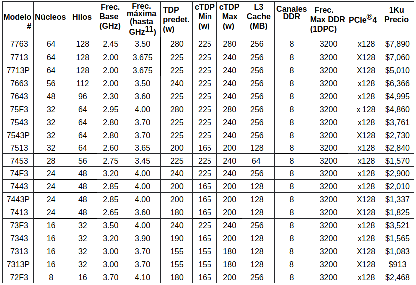

### Bandwidth through L3

There are 6 L3PMC's (ChL3PmcCfg). The event is `0x0300c00000400104`. In bits:

| Name        | 63:60 | 56:59      | 55:51 | 50:48   | 47         | 46          | 45  | 44:42  | 41:23 | 22  | 21:16 | 15:8     | 7:0      |
|-------------|-------|------------|-------|---------|------------|-------------|-----|--------|-------|-----|-------|----------|----------|
| Reg         | R     | ThreadMask | R     | SliceId | EnAllCores | EnAllSlices | R   | CoreId | R     | En  | R     | Umask    | EvSel    |
| L3 Accesses | 0     | R11        | 00000 | 000     | 1          | 1           | 0   | 0      | 0     | 1   | 0     | 11111111 | 00000100 |
| L3 Misses   | 0     | R11        | 00000 | 000     | 1          | 1           | 0   | 0      | 0     | 1   | 0     | 00000001 | 00000100 |

### Bandwidth tests

Node features:
- 2xCPU (2P) AMD 7773X, 64+64 cores, 128+128 threads, 2.2GHz nominal, 3.5GHz boost.
- x16 DDR4 DIMMs, 64GB each, 3200 MT/s, 64 bits of data width.
- 8 channels (A to H). Up to two DIMMs per channel (2DPC). 4 NUMA nodes per socket (NPS4).
- 204,8 GB/s bandwidth peak (3200 * 8 * 8) per socket. ¿410 GB/s per two NUMA sockets? ¿NPS0?
- 768 MB of L3.

Test features:
- MPI BT of class C for 64 and 121 processes.
- 5 seconds sampling.
- OpenMPI. Bindings:
  - Socket 0. Command: `-cpus-per-proc 1 --map-by core`.
  - Paired CCDS. It means CCDs number 0, 2, 4 and 6 of each socket. Command: `-cpus-per-proc 1 --map-by numa`
  - Balanced or paired CPUs. Command: `--cpu-set 0,2,4,6,8,10,12,14,16,18,20,22,24,26,28,30,32,34,36,38,40,42,44,46,48,50,52,54,56,58,60,62,64,66,68,70,72,74,76,78,80,82,84,86,88,90,92,94,96,98,100,102,104,106,108,110,112,114,116,118,120,122,124,126 --bind-to core`
  - All cores: `-cpus-per-proc 1`

| Test | Procs | Mapping  | CAS S0      | GB/s S0 | CAS S1      | GB/s S1 | Total GB/s |
|------|-------|----------|-------------|---------|-------------|---------|------------|
| L3   | 64    | socket   | 7564645686  | 96,8    | 2777526     | 0,3     | 97,1       |
| DF   | 64    | socket   | 12351814750 | 158,1   | 29430524    | 0,4     | 158,5      |
| HSMP | 64    | socket   | 744         | 174,0   | 0           | 0       | 174,0      |
| L3   | 64    | ccd      | 5909105321  | 75,6    | 5851253740  | 74,9    | 150,5      |
| DF   | 64    | ccd      | 9640513740  | 123,4   | 9556235328  | 122,3   | 245,7      |
| HSMP | 64    | ccd      | 825         | 165,0   | 625         | 125,0   | 290,0      |
| L3   | 64    | balanced | 4161707731  | 53,3    | 5331152758  | 68,2    | 121,5      |
| DF   | 64    | balanced | 7833084984  | 100,2   | 7799089330  | 99,8    | 200,0      |
| HSMP | 64    | balanced | 610         | 122,0   | 605         | 121,0   | 243,0      |
| L3   | 121   | core     | 7338690514  | 93,9    | 7189872719  | 92,0    | 185,9      |
| DF   | 121   | core     | 11730843560 | 150,2   | 11504687594 | 147,3   | 297,5      |
| HSMP | 121   | core     | 795         | 159,0   | 785         | 157,0   | 316,0      |

* This BT.C huge bandwidth was validated in Intel Icelake, whose bandwidth obtained was 287 GB/s.

### RAPL

- Per socket.
- `./fakempi.sh 64 perf bench sched pipe --loop 5000000`
- `available frequency steps:  2.20 GHz, 1.90 GHz, 1.50 GHz`
- ^ means equal to the previous value.

| Powercap   | Governor                 | Avg. Freq. (MHz) | W. RAPL    | W. HSMP    |
|------------|--------------------------|------------------|------------|------------|
| 280 (tdp)  | Performance              | 3200             | 248        | 242        |
| 200 (-30%) | Performance              | 2700 (-15%)      | 187 (-25%) | 183 (-25%) |
| 120 (-60%) | Performance              | 1550 (-50%)      | 115 (-55%) | 111 (-55%) |
| 100 (-65%) | Performance              | 900 (-70%)       | 91 (-65%)  | 89 (-65%)  |
| 280 (tdp)  | Userspace (2200)         | 3200*            | 248        | 242        |
| 280 (tdp)  | Userspace (2100)         | 3200*            | ^          | ^          |
| 280 (tdp)  | Userspace (1900)         | 1900*            | 129        | 124        |
| 280 (tdp)  | Userspace (1600)         | 1900*            | ^          | ^          |
| 280 (tdp)  | Userspace (1200)         | 1500*            | 114        | 110        |
| 200 (-30%) | Userspace (2200)         | 2700 (-15%)      | 187 (-25%) | 183 (-25%) |
| 120 (-60%) | Userspace (2200)         | 1550 (-50%)      | 115 (-55%) | 111 (-55%) |
| 200 (-30%) | Userspace (1900)         | 1900 (-40%)      | 129 (-50%) | 124 (-50%) |
| 120 (-60%) | Userspace (1900)         | 1550 (-50%)      | 115 (-55%) | 111 (-55%) |
| 200 (-30%) | Userspace (1500)         | 1500 (-55%)      | 114 (-55%) | 110 (-55%) |
| 120 (-60%) | Userspace (1500)         | 1500 (-55%)      | 113 (-55%) | 109 (-55%) |
| 280 (tdp)  | Performance+HSMP (2200)  | 2200 (-30%)      | 148 (-40%) | 143 (-40%) |
| 120 (-60%) | Performance+HSMP (2200)  | 1550 (-30%)      | 115 (-55%) | 111 (-55%) |
| 120 (-60%) | Performance+HSMP (2200)* | 1550 (-30%)      | 115 (-55%) | 111 (-55%) |

* it seems to run only in one of the three frequency steps, not between them.
* Setting the frequency after setting the power, but even doing that the powercap system has the control of the frequency. But in case you are launching less processes than required to cap the power of the socket, the control of the frequency is passed to the frequency system, and you can reach easily the boost frequency for a limited set of processes.

### Other interesting things

