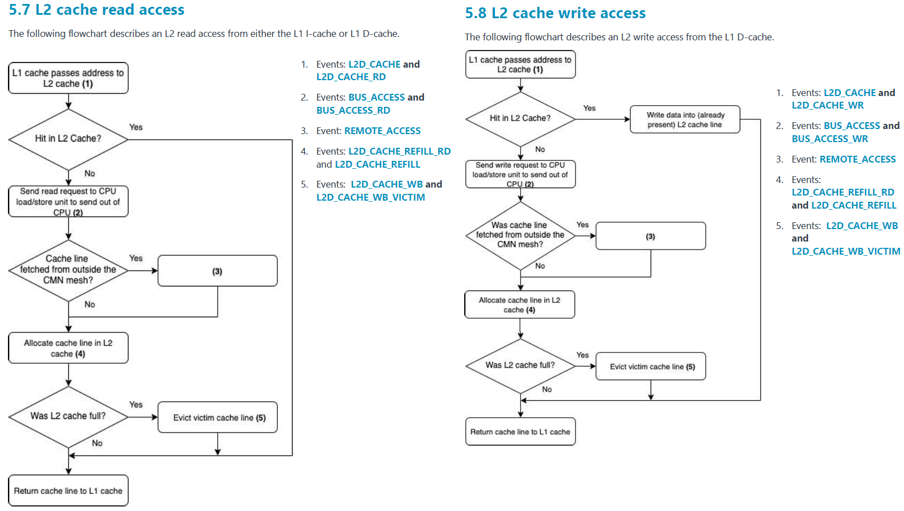

## Overview

Is an ARM8.2a from 2019, intended for datacenters and high-performance computing use.

These are the features shown by cpuinfo `fp asimd evtstrm aes pmull sha1 sha2 crc32 atomics fphp asimdhp cpuid asimdrdm lrcpc dcpop asimddp ssbs`. So don't have SVE.

### Documents

- Arm Neoverse N1 Core: Technical Reference Manual (640 pages).
- Arm Neoverse Core N1: Performance Analysis Methodology (34 pages).
- Arm Neoverse N1: PMU Guide (84 pages).

### FLOPs

The table of events doesn't show any signs of SVE. It just says ASE_SPEC (Advanced SIMD Extension, also known as NEON or ASIMD). The ASE_SPEC is specified in [Arm Architecture Reference Manual for A-profile architecture](https://developer.arm.com/documentation/ddi0487/latest) among others:

| Name      | Event | Description                                                                                    |
|-----------|-------|------------------------------------------------------------------------------------------------|
| INST_SPEC | r1b   | Counts instructions that are Speculatively executed (not necessarily retired or execueted).    |
| DP_SPEC   | r73   | Counts each integer data-processing operations. Including miscellaneus instructions.           |
| ASE_SPEC  | r74   | Counts each operation counted by INST_SPEC that is an Advanced SIMD data-processing operation. |
| VFP_SPEC  | r75   | Counts operations speculatively executed, scalar floating-point. Neon is not included.         |

You can't calculate anything interesting, just a hint of non-SIMD floating point operations and ARM NEON utilization.

### Cache

N1 manuals about the L3: `This event does not count on the Neoverse V1.`. But these events: LL_CACHE_RD and LL_CACHE_MISS_RD does it in some conditions. These events will be explored later. 

Note that AArch64 do not support cache MISS counters, but only REFILLs. A cache miss could lead to multiple cache line refills if the access is on a cache line boundary or multiple cache misses could be satisfied by a single REFILL.

On systems which support a shared system level cache in the interconnect, LL_CACHE_RD counts the total accesses to the SLC. In a system that has the SLC configured to count LL_CACHE_RD events, LL_CACHE_RD counter counts total SLC accesses made by the core and LL_CACHE_MISS_RD counts the access missed at SLC.

Last level cache events do not have a write variant in Neoverse V1
since SLC is only used as an eviction cache for the core and all the writes complete early at the interconnect when the transaction is acknowledged but not necessarily completed.

| Name             | Event | Description                                                                                                                                                                                                                                                                                                                                                                                                                                                                                                                                                                                                                               |
|------------------|-------|-------------------------------------------------------------------------------------------------------------------------------------------------------------------------------------------------------------------------------------------------------------------------------------------------------------------------------------------------------------------------------------------------------------------------------------------------------------------------------------------------------------------------------------------------------------------------------------------------------------------------------------------|
| L1D_CACHE_REFILL | r03   | Counts level 1 data cache refills caused by speculatively executed load or store operations that missed in the level 1 data cache. This event only counts one event per cache line. This event does not count cache line allocations from preload instructions or from hardware cache prefetching.                                                                                                                                                                                                                                                                                                                                        |                                                                                                                                                                                                                                                                                                                                        
| L1D_CACHE_WB     | r15   | Counts write-backs of dirty data from the L1 data cache to the L2 cache. This occurs when either a dirty cache line is evicted from L1 data cache and allocated in the L2 cache or dirty data is written to the L2 and possibly to the next level of cache. This event counts both victim cache line evictions and cache write-backs from snoops or cache maintenance operations. The following cache operations are not counted: 1. Invalidations which do not result in data being transferred out of the L1 (such as evictions of clean data), 2. Full line writes which write to L2 without writing L1, such as write streaming mode. | 
| L2D_CACHE_REFILL | r17   | Counts cache line refills into the level 2 cache. level 2 cache is a unified cache for data and instruction accesses. Accesses are for misses in the level 1 caches or translation resolutions due to accesses.                                                                                                                                                                                                                                                                                                                                                                                                                           |
| L2D_CACHE_WB     | r18   | Counts write-backs of data from the L2 cache to outside the CPU. This includes snoops to the L2 (from other CPUs) which return data even if the snoops cause an invalidation. L2 cache line invalidations which do not write data outside the CPU and snoops which return data from an L1 cache are not counted. Data would not be written outside the cache when invalidating a clean cache line.                                                                                                                                                                                                                                        |
| L3D_CACHE_REFILL | r2a   | Counts level 3 accesses that receive data from outside the L3 cache.                                                                                                                                                                                                                                                                                                                                                                                                                                                                                                                                                                      |
| LL_CACHE_MISS_RD | r37   | Counts read transactions that were returned from outside the core cluster but missed in the system level cache. This event counts when the system register CPUECTLR.EXTLLC bit is set. This event counts read transactions returned from outside the core if those transactions are missed in the System level Cache. The data source of the transaction is indicated by a field in the CHI transaction returning to the CPU. This event does not count reads caused by cache maintenance operations.                                                                                                                                     |

### Bandwidth

The MEM_ACCESS event counts the total number of memory operations that were issued by the Load Store Unit (LSU) of the core. As these operations are looked up in the L1D_CACHE first, both the events L1D_CACHE and MEM_ACCESS count at the same rate. Neoverse V1 also supports two additional events, MEM_ACCESS_RD and MEM_ACCESS_WR, that can provide the read and write traffic breakdown respectively. Note that these events are not the same as LD_SPEC and ST_SPEC since they count memory operations speculatively issued, but not necessarily executed. Not counted: Instruction fetches, Cache maintenance instructions, Translation table walks or prefetches, Memory prefetch operations.

The BUS_ACCESS event has multiple definitions:
1) Counts memory transactions issued by the CPU to the external bus, including snoop requests and snoop responses.
2) Counts for every beat of data transferred over the data channels between the core and the Snoop Control Unit (SCU).
3) Counts any memory accesses issued by the load/store memory system (also referred to as the L2 system) from the CPU to the DSU. Since the DSU is always implemented with a the direct connect configuration, the transaction will go to the system interconnect (bus).
4) Counts each Memory-read operation or Memory-write operation that accesses outside of the boundary of the PE (Processing Element) and its closely-coupled caches. Where this boundary lies with respect to any implemented caches is IMPLEMENTATION DEFINED. Where an implementation has multiple buses at this boundary, this event counts the sum of accesses across all buses. Bus transactions include refills of and write-backs from data, instruction, and unified caches. Whether bus transactions include operations that use the bus but do not explicitly transfer data is IMPLEMENTATION DEFINED. An Unattributable bus transaction occurs when a requestor outside the PE makes a request that results in a bus access, for example, a coherency request.

A snooper is a coherency controller, monitors (or snoop) the bus transactions, and its goal is to maintain cache coherency in a distributed shared memory (DSM) systems. When specific data is shared by several caches and a processor modifies the value of the shared data, the change must be propagated to all the other caches which have a copy of the data. This change propagation prevents the system from violating cache coherency. The notification of data change can be done by bus snooping. All the snoopers monitor every transaction on a bus. There are two kinds of snooping protocols depending on the way to manage a local copy of a write operation: write-invalidate and write-update. More info on [wikipedia](https://en.wikipedia.org/wiki/Bus_snooping).

Acording to ARM documentation, within the DSU (DynamIQ Shared Unit), are the L3 cache, the Snoop Control Unit (SCU), internal interfaces to the cores, and external interfaces to the SoC. It also seems to include peripherial port.


| Name          | Event | Description                                                              |
|---------------|-------|--------------------------------------------------------------------------|
| BUS_ACCESS    | r19   | Explanations above. Take BUS_WIDTH into de account to compute bandwidth. |
| BUS_ACCESS_RD | r60   | ...                                                                      |
| BUS_ACCESS_WR | r61   | ...                                                                      |
| MEM_ACCESS    | r13   | Explanations above.                                                      |
| MEM_ACCESS_RD | r66   | ...                                                                      |
| MEM_ACCESS_WR | r67   | ...                                                                      |

**Important!** The scope of these events seems to be per core. After the following perf command was launched:
```
> perf stat -aA -e r19 perf bench mem memcpy --size 10GB
CPU0            2,835,659,828      r19                                                         
CPU1                   43,104      r19                                                         
CPU2                   13,804      r19                                                         
CPU3                    2,964      r19                                                         
CPU4                    6,416      r19                                                         
CPU5                    6,838      r19
...
```

But **Important!**, this is what a field in register `PMMIR_EL1` says about BUS_ACCESS:
- Each transfer is up to this number of bytes. An access might be smaller than the bus width. When this field is nonzero, each access counted by BUS_ACCESS is at most BUS_WIDTH bytes. An implementation might treat a wide bus as multiple narrower buses, such that a wide access on the bus increments the BUS_ACCESS counter by more than one.<br>

So, it count accesses, but is not possible to use it to count bandwidth.

Maybe the L2 misses are the key of the bandwidth?



### Other resources

- [Wikichip](https://en.wikichip.org/wiki/arm_holdings/microarchitectures/neoverse_n1)