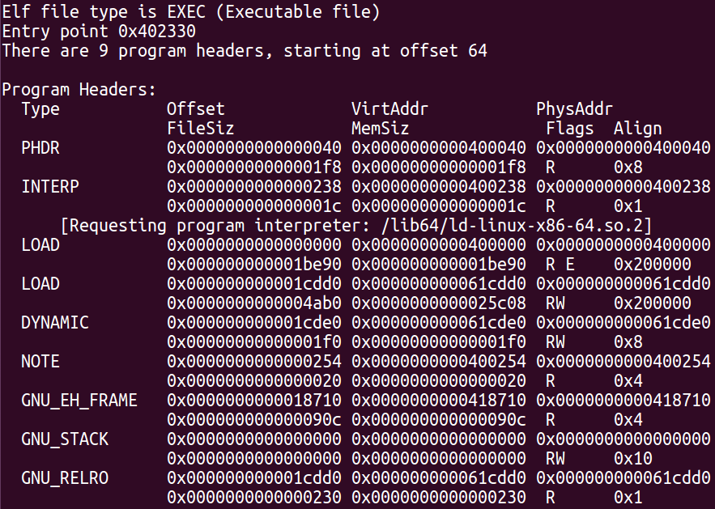
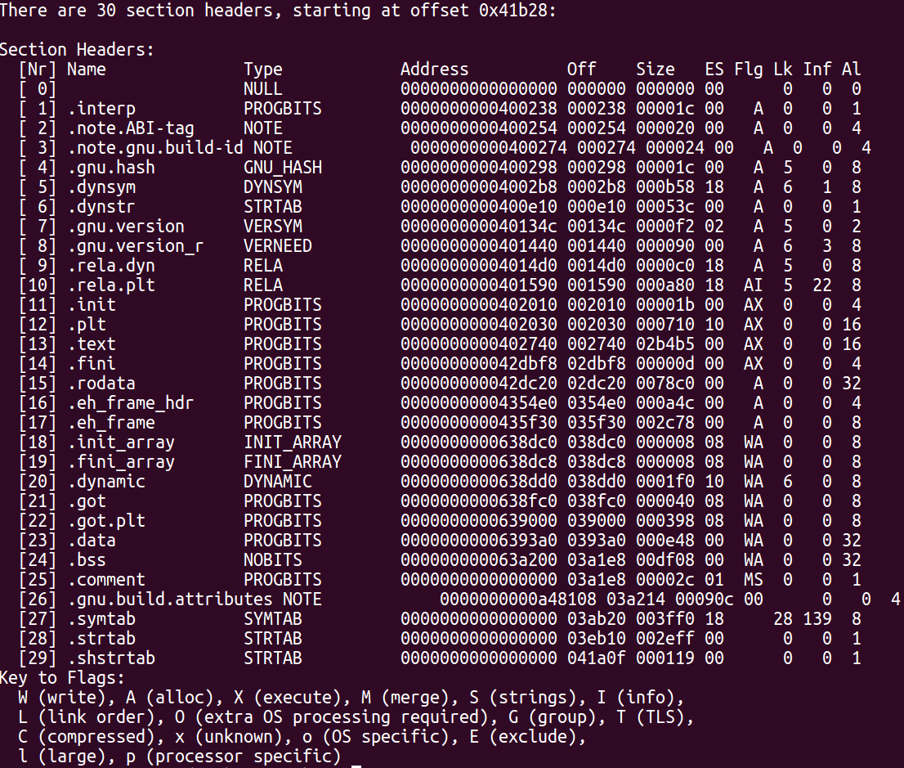

## ELF format

ELF is the standard Linux binary format. There are some types of ELFs:

### File types

| Name      | Description                                                                        |
| --------- | ---------------------------------------------------------------------------------- |
| ET_REL    | Relocatable files. It is a relocatable peace of code (objects). Also known as Position Independent Code (PIC), it has not been linked into an executable yet. |
| ET_EXEC   | Executable files. They have an entry point.                                        |
| ET_DYN    | This is a dynamic library (or shared object).                                      |
| ET_CORE   | Full process image dumped after a crash. GDB can read these files.                 |
| ET_NONE   | Unknown type.                                                                      |

### ELF file header

In a binary, at position 0, there is the ELF file header. This header marks the ELF type, the architecture, and the entry point address where execution is to begin, and provides offsets to the other types of ELF headers (section headers and program headers). Looking at the [`ELF(5)`] man page in Linux shows us the ELF header structure:

[`ELF(5)`]: https://man7.org/linux/man-pages/man5/elf.5.html

```
#define EI_NIDENT 16

typedef struct {
    unsigned char e_ident[EI_NIDENT];
    uint16_t      e_type;
    uint16_t      e_machine;
    uint32_t      e_version;
    ElfN_Addr     e_entry;
    ElfN_Off      e_phoff; //program header table offset
    ElfN_Off      e_shoff; //section header table offset
    uint32_t      e_flags; //r,w,x
    uint16_t      e_ehsize;
    uint16_t      e_phentsize;
    uint16_t      e_phnum; //number of program headers
    uint16_t      e_shentsize;
    uint16_t      e_shnum; //number of section headers
    uint16_t      e_shstrndx;
} ElfN_Ehdr;
```

### Segments and ELF program headers

These headers describe **segments**. Segments contain data required for run time execution. They describe the memory layout of an executable in disk and how it should translate to memory. The **program header table** can be accessed by referencing the offset found in the ELF file header member called **e_phoff**. All of segment headers are contiguous in the table. The content of these headers can be found in [`ELF(5)`]:

```
typedef struct {
    uint32_t   p_type;
    uint32_t   p_flags; //r,w,x
    Elf64_Off  p_offset;
    Elf64_Addr p_vaddr; //virtual address
    Elf64_Addr p_paddr; //physical address (for systems that use it)
    uint64_t   p_filesz; //size of segment in file
    uint64_t   p_memsz; //size of segment in memory
    uint64_t   p_align;
} Elf64_Phdr;
```

There are 4 types of segments:

| Type       | Description                                                                          |
| ---------- | ------------------------------------------------------------------------------------ |
| PT_LOAD    | Data that it has to be mapped into memory (aka loaded). Can contain a segment for program code, data for global variables, dynamic linking information... |
| PT_NOTE    | Specific information pertinent to specific vendor or system (example, ABI). |
| PT_INTERP  | Small segment containing the location and size of the null terminated string indicating the program interpreter (example: /lib/linux-ld.so, the dynamic linker). |
| PT_PHDR    | Contains the location and size of the program header table, with all of the program headers describing the segments of the file and memory. |
| PT_DYNAMIC | Specific to executables that are dynamically linked and contains information necessary for the dynamic linker. This segment contains **tagged values and pointers**, including list of shared libraries, the address of the Global offset table (GOT), information of relocation entries... |
| PT_GNU_EH_FRAME | Specifies the location and size of the exception handling information as defined by the .eh_frame_hdr section. |
| PT_GNU_STACK    | Is used to indicate wether the stack should be executable. The absense of this header indicates that the stack will be executable. |
| PT_GNU_RELRO    | specifies the location and size of a segment which may be made read-only after relocation shave been processed. |

The **PT_DYNAMIC** segment tags are described in the following table:

| Tag          | Description                                                                                     |
| ------------ | ----------------------------------------------------------------------------------------------- |
| DT_HASH      | Address of symbol hash table.                                                                   |
| DT_GNU_HASH  | A better hash table for the ELF used by GNU systems in GNU-compatible software                  |
| DT_STRTAB    | Address of string table.                                                                        |
| DT_SYMTAB    | Address of symbol table.                                                                        |
| DT_RELA      | Address of Rela relocs table.                                                                   |
| DT_INIT/FINI | Address of the initialization/termination functions.                                            |
| DT_REL       | Address of Rel relocs table.                                                                    |
| DT_PLTREL    | Type of reloc the PLT refers (Rela or Rel).                                                     |
| DT_PLTGOT    | Address of PLT and/or GOT.                                                                      |
| DT_DEBUG     | Undefined use for debugging.                                                                    |
| DT_TEXTREL   | Absence of this indicates that no relocs should apply to a nonwritable segment.                 |
| DT_JMPREL    | Address of reloc entries solely for the PLT.                                                    |
| DT_BIND_NOW  | Instructs the dynamic linker to process all relocs before transferring control to the executable. |
| DT_SONAME    | String table offset to name of shared object.                                                   |
| DT_RPATH     | String table offset to library search path.                                                     |
| DT_SYMBOLIC  | Alert linker to search this shared object before the executable for symbols.                    |
| DT_RUNPATH   | String table offset to library search path.                                                     |
| DT_NEEDED    | String table offset to library names.                                                           |
| DT_VERNEED   | The address of the version dependency table. It contain indexes into the string table DT_STRTAB.  |
| DT_NULL      | Marks end of dynamic segment.                                                                   |
| ...          | There are more. You can search in [`Oracle documentation`] for more.                            |

[`Oracle documentation`]: https://docs.oracle.com/cd/E23824_01/html/819-0690/chapter6-42444.html

* The Z, ENT or NUM terminated tags contains sizes or number of elements.
* The A in RELA means addend.

You can use `readelf --segments --wide` to view the program header table, where we can see the entry point, RWX flags and alignments:



### Sections and ELF section headers

**Sections** are divisions of segments, in example, a PT_LOAD segment can contain a section of data such as global variables and a section of code.

Section headers contain important data for linking and relocation during compilation. These headers are optional, are not required to run a program. In that case **e_shoff** in the ELF file header is set to 0. All that headers are contiguous in the table, and the shape of these headers can be found in [`ELF(5)`]:

```
typedef struct {
    uint32_t   sh_name;
    uint32_t   sh_type;
    uint64_t   sh_flags; //r,w,x,alloc
    Elf64_Addr sh_addr;
    Elf64_Off  sh_offset;
    uint64_t   sh_size;
    uint32_t   sh_link;
    uint32_t   sh_info;
    uint64_t   sh_addralign;
    uint64_t   sh_entsize;
} Elf64_Shdr;
```
Types of sections:

| section types | info                                                  |
| ------------- | ----------------------------------------------------- |
| SHT_NULL      | Section header table entry unused.                    |
| SHT_PROGBITS  | Program data.                                         |
| SHT_SYMTAB    | Symbol table.                                         |
| SHT_STRTAB    | String table.                                         |
| SHT_DYNSYM    | Dynamic linker symbol table.                          |
| SHT_RELA      | Relocation entries with addends.                      |
| SHT_HASH      | Symbol hash table.                                    |
| SHT_DYNAMIC   | Dynamic linking information.                          |
| SHT_NOTE      | Notes.                                                |
| SHT_NOBITS    | Program space with no data in file (bss).             |
| SHT_REL       | Relocation entries, no addends.                       |
| SHT_SHLIB     | Reserved.                                             |
| SHT_INIT/FINI | Array of constructors/destructors, also [`pre-init`]. |
| ...           | There are more.                                       |

[`pre-init`]: http://dbp-consulting.com/tutorials/debugging/linuxProgramStartup.html

These types are divided in subtypes and have different names like text, rodata, data, bss, plt, got.plt, dynsym, dynstr, symtab, strtab, shstrtab, rel/a.*, hash, note, interp, gnu.hash, gnu.version, eh_frame_hdr, eh_frame, dynamic, etc...

You can use `readelf --sections --wide` to view the section header table::



You can see an ELF map [`here`](./img/elf-map.png).

## Linking and relocation during compilation

During the final step of the compilation, the linker resolves all the symbols contained in object files (aka relocatable object files).

A static function is called through an offset in call instruction, because is just visible from the same module. But if a function is not static, it can be called from other objects (static linking) or maybe belongs to a dynamic library (dynamic linking), so the calls to that function can not be resolved yet and the information of that symbol is written in rel/rela section for later. In case of static linking, the compiler leaves the task of resolving to the linker, which takes all that metadata and finally writes the correct references when all sections are merged.

Finally, the calls to dynamic library functions, are resolved in runtime by the PLT and GOT mechanisms.

## PLT and GOT tables and dynamic linking

These tables are involved in the dynamic linking process, when the linker could not resolve symbol addresses statically.

Procedure Linkage Table is a read only table in ELF file that stores all necessary symbols that need a resolution (like print) because don't belong to the binary. Keep in mind that this resolution happens when a call to the function is performed. It will invoke the dynamic linker to resolve the address of the requested function at run time.

Global Offset Table is a writable memory that is used to store pointers to the functions resolved. Once the dynamic linker resolves a function then it will update GOT to have that entry read for usage.

This is the lazy binding process from a point of view of an executable:
1) When program calls a function that do not belong to is binary (i.e: print), the first address to call is its symbol entry in the PLT section (its read only).
2) The PLT address contains a JMP to an address contained in the GOT.
3) The address contained in the GOT is just the following instruction of the current JMP in PLT  of the point `2`.
4) That following instruction is a push of the symbol identifier in the stack, followed by a JMP intruction to a small peace of code called default stub.
5) The stub pushes the address of the GOT in the stack and calls the dynamic linker.
6) The dynamic linker now knows the symbol to search because it has its ID, then replaces the address in the GOT by the true address of print.
7) The binding is complete and the following calls will JMP directly to the print address.

In the point of view of a shared library, compiling with `-fPIC` is required, because turns code into position independent. The calls inside the library uses GOT and a copy of the data section is allocated in the process. 

There are more information [`here`](https://eli.thegreenplace.net/2011/11/03/position-independent-code-pic-in-shared-libraries).

## Virtual memory

In Linux, each process has a linear space address (called virtual or logical) and its own page tables. The processor MMU translates, with the page tables, the virtual addresses into physical addresses in runtime. Each process has also different start/base address, so it maps at different addresses even the same shared libraries. This is because Linux uses ASLR (address space layout randomization) to grant a base address to newly created process, because security reasons.

## Entry points

For a map of the ELF entry points take a look [`here`](/img/elf-entry-points.png).

## Symbol visibility


mmap copy on write
mmap vs open file, read file, write file, llamadas al sistema, mapeas y te olvidas
`-Wl,--dynamic-list`
`-rdynamic`
`-export-dynamic`
`perf list --detail`

## Debugging tools

| Name    | Description                                                                        |
| ------- | ---------------------------------------------------------------------------------- |
| gstack  | Print stack trace of running process.                                              |
| objdump | Code disassembler.                                                                 |
| objcopy | Analyze and modify ELF objects.                                                    |
| strace  | Based on [`ptrace(2)`], show information about syscalls activies during runtime.   |
| ltrace  | Parses the library-linking information of a program and prints used functions.     |
| readelf | Dissects ELF binaries.                                                             |
| ldd     | Print shared objects required by the program.                                      |

[`ptrace(2)`]: https://man7.org/linux/man-pages/man2/ptrace.2.html

### Examples

```
# Running basic gstack
gstack <pid> 

# Running basic ltrace
ltrace <program> -o program.out

# Retrive symbol table
readelf -s <object>

# Retrive the program header table
readelf -l <object>
```

## Other debugging options

- Define [`LD_DEBUG`] to display information of runtime behavior.
- Define LD_SHOW_AUXV to display the program auxiliary vector (information placed in the stack).
- Print /proc/\<pid\>/maps to show the process image.

[`LD_DEBUG`]: https://man7.org/linux/man-pages/man8/ld.so.8.html