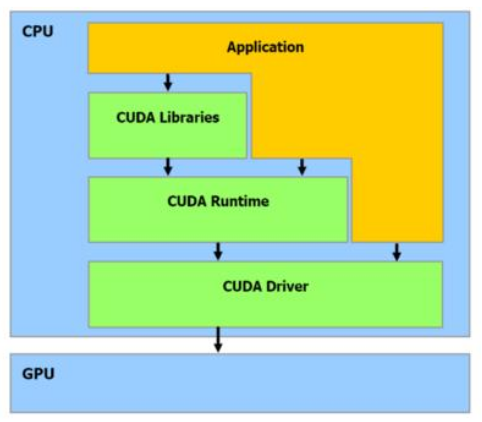
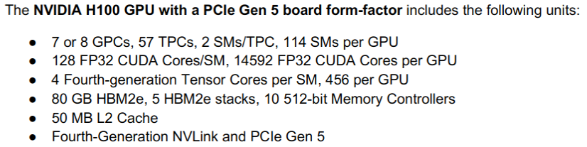

### Overview

- No branch prediction.
- Long latency, but high throughput.
- Host is the CPU, device is the GPU.

### Programming overview

The Driver API is harder to program but provided more control over how CUDA is used. The programmer has to directly deal with initialization (including Context), module loading, etc.

In contrast, the CUDA Runtime makes it possible to compile and link your CUDA kernels into executables. This means that you don't have to distribute cubin files with your application, or deal with loading them through the driver API. As you have noted, it is generally easier to use, and Context is not exposed (it is used a Primary Context, which is created as needed).

Apparently more detailed device information can be queried through the driver API than through the runtime API. For instance, the free memory available on the device can be queried only through the driver API.

CUDA Runtime functions have the prefix `cuda`, unlike CUDA Driver whose prefix is `cu`.

On the other hand there are some libraries:

| Library      | Description                                                  |
|--------------|--------------------------------------------------------------|
| libcuda.so   | The NVIDIA CUDA Driver library.                              |
| libcudart.so | The NVIDIA CUDA Runtime library.                             |
| libcublas.so | The NVIDIA cuBLAS (Basic Linear Algebra Subroutine) library. |
| libcufft.so  | The NVIDIA cuFFT (Fast Fourier Transform) Libraries.         |

### CUDA Cores, Streaming Processors and those jargon

The best we can do to understand is to write a table comparison: 

| Nvidia                      | H100   | V100  | Comments                                                                                                                                       |
|-----------------------------|--------|-------|------------------------------------------------------------------------------------------------------------------------------------------------|
| Cuda Cores (CC) (FP32)      | 14.592 | 5.120 |                                                                                                                                                |
| Stream Multiprocessors (SM) | 114    | 80    | SMs process only one block at time. You need 114/80 blocks to occupy the system. This is because shared memory, which is a per block resource. |
| CCs (FP32) per SM           | 128    | 64    |                                                                                                                                                |
| Cuda Cores per thread       | 1      | 1     |                                                                                                                                                |
| Threads per Warp            | 32     | 32    | Warp is an implementation decision, not part of CUDA programming model.                                                                        |
| Threads per block (TB)      | 1024   | ?     |                                                                                                                                                |
| Warps per thread block      | 32     | ?     |                                                                                                                                                |
| Concurrent warps per SM     | ?      | 2     | In theory depends on the instruction. 4 FP32 warps fit in an SM. But depends on the schedulers.                                                |
| Thread Block Cluster        | ?      | -     | New concept.                                                                                                                                   |

Taken from the [H100 GPU Architecture White Paper](https://resources.nvidia.com/en-us-tensor-core/gtc22-whitepaper-hopper)

| Nvidia | Architecture | Year | CC per SM |
|--------|--------------|------|-----------|
| H100   | Hopper       | 2022 | 128       |
| TU100  | Ampere       | 2020 | 64        |       
| A100   | Turing       | 2018 | 64        |       
| V100   | Volta        | 2017 | 64        |    

### Course

thrust::device_vector<float> deviceInput1(inputLength);
thrust::device_vector<float> deviceInput2(inputLength);
thrust::copy(hostInput1, hostInput1 + InputLength, deviceInput1.begin());

1) vecAdd(float *h_a, float *h_b, float *h_c)
2) Allocate device memory for A, B, and C.
3) Copy A and B to device memory
4) Kernel launch
5) Copy C from device memory to host memory
6) Free device vectors

Unified memory
DMA, why? The CPU has the control of DMA.

Grid -> Blocks -> Threads -> Registers
But it has global memory, shared by all the threads.

cudaMalloc allocates memory in the device. Needs a pointer to the object, and the number of bytes
cudaMemcpy transfers data from host to device or device to host. Args are both pointers, size an direction.

cudaMalloc d_A size
cudaMemcpy d_A h_A size cudaMemcpyHostToDevice
cudaMalloc d_B size
cudaMemcpy d_B h_B size cudaMemcpyHostToDevice
cudaMalloc d_C size
Kernel invocation
cudaMemcpy h_C d_C size cudaMemcpyDeviceToHost
cudaFree dA d_B d_C

Best practice: check for errors

NameOfTheKernel<<<#Blocks,#Threads>>>(args)

All threads in a Grid run the same kernel code

i = blockIdx.x * blockDim.x + threadIdx.x
C[i] = A[i] + B[i]

- Threads in different blocks do not interact
- Threads within a block cooperate via shared memory, atomic operations and barrier synchronization.

Nvidia provides a compiler nvcc

__global__ void mykernel(void) {}
mykernel<<<1, 1>>>();
Compile by .cu extension

Debuggers from nvidia: nsight, cuda-gdb and cuda memcheck
-Xcompiler -fopenmp for host compiler flags
-g for host debug, -G device debugging symbols, -lineinfo to include line information with symbols
cuda-memcheck no recompilation required cuda-memcheck ./binary
cuda-gdb --args ./a.out
nvprof comand line profiler, nvprof--query-metrics
nvtx

vecAdd<<<ceil(n/256.0),256>>>(d_A, d_B, d_C, n)
if (i<n) because sometimes gpu adds more threads than required

dim3 dimGrid((n-1)/256+1, 1, 1)
dim3 dimBlock(256, 1, 1)
vecAdd<<<dimGrid,dimBlock>>>(...)

It depends on the GPU stream processors

__device__ executed in the device and only callable for trom the device
__global__ executed on the device and only callable from the host
__host__ executed on the host and only callable from the host

The is a Just-in-time compiler (PTX)

row = idx.y*dim.y + tid.y
col = idx.x*dim.x + idx.x
if (row < hight && col < width)

Threads are assigned to SMs in block granularity
Up to 8 blocks to each SM as resource allows
Fermi SM can take up to 1536 threads
Could be 256 (threads/block) * 6 blocks
Or 512 (threads/block) * 3 blocks, etc
SM maintains thread/block idxs #s
SM manages/schedules thread execution

Each bock is executed as 32 threads warps, and this is an implementatio decision, not part of CUDA programming model.
Warps are scheduling units in the SM
This may change in the future

0 contexts switches between warps

ceil(8000/1024)*1024 = 8*1024*

there is a limitation in the blocks that a gpu can manage also, not just the stream processors
The threads in the same thread block run on the same stream processor.

In fermi, Streaming Multiprocessor (SM): compuesto por 32 núcleos CUDA. At the SM level, each warp scheduler distributes warps of 32 threads to its execution units. Threads are scheduled in groups of 32 threads called warps. Each SM features two warp schedulers and two instruction dispatch units, allowing two warps to be issued and executed concurrently. The dual warp scheduler selects two warps, and issues one instruction from each warp to a group of 16 cores, 16 load/store units, or 4 SFUs. Most instructions can be dual issued; two integer instructions, two floating instructions, or a mix of integer, floating point, load, store, and SFU instructions can be issued concurrently. Double precision instructions do not support dual dispatch with any other operation.

Por lo que he entendido entonces en un SM va solo un bloque pero se pueden ejecutar dos warps a la vez, al menos en fermi. Porque un SM tiene 32 cores que pueden ejecutar varias instrucciones a la vez.

Nvidia Xavier
Global memory
Constant memory
Shared memory, can be used to reduce bandwidth to the global memory, is for the use of programmer. Is also called scatchpad memory. Is like a bench of work, and then you send the data back to the global memory.

int localvar -> register
__device__ __shared__  -> shared by the threads in the block
__device__ -> global, for the grid
__device__ __constant__ -> constant memory in the grid

__syncthreads() to synchronize all threads in a block

In fermy, for an SM, you have 16KB of shared memory.
Parece que aquí dicen que en Fermi tienes 1536 threads per SM, pero sabemos que no, es confuso

If some of the threads of the warps takes one path a and others the another, they are computing both if and the else.

Computational intensity

Each block is divided in 32 threads warps, and are scheduling units in Stream Multiprocessors.
Taking into account warps is just a matter of performance.
The thread blocks are linearized into 1D row of major order. Warp 0 starts with Thread 0.
All threads in a warp execute the same instructions.
Is not recomended the control flow instructions.

Seems that shared memory acts like a cache but just for 4 bytes. If warps loads an address value, if all the other threads loads the same address, just 1 load is made.

Pinned memory is a memory not pageable, it means is there and enhances the transfer to the GPU.
https://linux.die.net/man/2/mlock

Peña mencionó OneAPI

Cuda Streams, para mantener a la GPU ocupada ejecutando cosas y pasando datos a través del PCI

The streams to form a graf

https://developer.nvidia.com/blog/a-guide-to-cuda-graphs-in-gromacs-2023/?mkt_tok=MTU2LU9GTi03NDIAAAGLP0WIaTYiZCXekuxz7iucuTK3EwWvmzlySkf10HmeoyZgAmL8MWLoZYzuz2LUVZjs0Ag2nis8JmhVymuATjhk1Ci59dVs7gLulb-Ikz_kaKBYKEI2
https://penny-xu.github.io/blog/tiled-matrix-multiplication