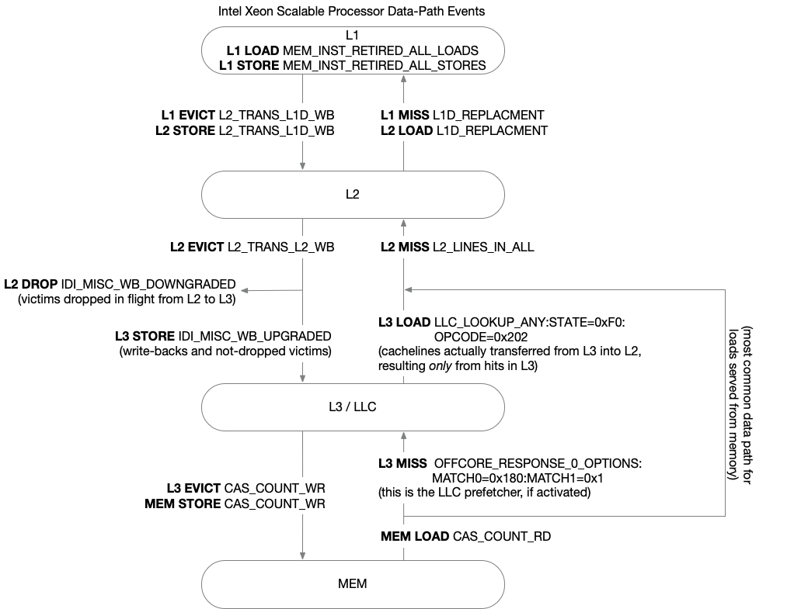

### Reading cache

Inherited from Haswell and Broadwell.

| Event            | Ev,Umask | Description                                                                          |
|------------------|----------|--------------------------------------------------------------------------------------|
| PERF_L1D_MISS_LD | Perf     | Counts L1D misses.                                                                   |
| L2_RQSTS.MISS    | 24,3f    | Counts L2 misses.                                                                    |
| L2_LINES_IN.ALL  | f1,1f    | Counts the number of L2 cache lines filling the L2. Counting does not cover rejects. |
| L2_TRANS.L2_WB   | f0,40    | Counts evicted lines that leaves the L2 cache to L3 or main memory.                  |

Using L2_TRANS.L2_WB+L2_LINES_IN.ALL instead L2_RQSTS.MISS we count the in-and-out data traffic between L2 and L3/main memory.

You can see an scheme of this by the people of Likwid:

### Reading IMC frequency

Reading UBox, 1 per socket.
DCLK (DRAM clocks)
UCLK (?)

U_MSR_PMON_FIXED_CTL 0x0703
U_MSR_PMON_FIXED_CTR 0x0704

MSR_U_PMON_UCLK_FIXED_CTL
MSR_U_PMON_UCLK_FIXED_CTR

2.11.3 Additional Uncore PMU MSRs in the Intel® Xeon® Processor E5 Family

2.14.1 Additional Uncore PMU MSRs in the Intel® Xeon® Processor E5 v3 Family

CHAPTER 2 MODEL-SPECIFIC REGISTERS (MSRS) (Volume 4)

MSRs Specific to the 4th Generation Intel® Xeon® Scalable Processor Family Based on Sapphire Rapids

The 4th generation Intel® Xeon® Scalable Processor Family based on Sapphire Rapids microarchitecture (CPUID
Signature DisplayFamily_DisplayModel value of 06_8FH) supports the MSRs listed in Section 2.17, “MSRs In the
6th Generation, 7th Generation, 8th Generation, 9th Generation, 10th Generation, 11th Generation, 12th Generation,
and 13th Generation Intel® Core™ Processors, Intel® Xeon® Scalable Processor Family, 2nd, 3rd, and 4th
Generation Intel® Xeon® Scalable Processor Family, 8th Generation Intel® Core™ i3 Processors, and Intel®
Xeon® E processors,” including Table 2-52. For an MSR listed in Table 2-52 that also appears in the model-specific
tables of prior generations, Table 2-52 supersedes prior generation tables.

--> 

These processors support the MSR interfaces listed in Table 2-20, Table 2-21, Table 2-25, Table 2-29, Table 2-35,
and Table 2-391. For an MSR listed in Table 2-39 that also appears in the model-specific tables of prior generations,
Table 2-39 supersede prior generation tables.